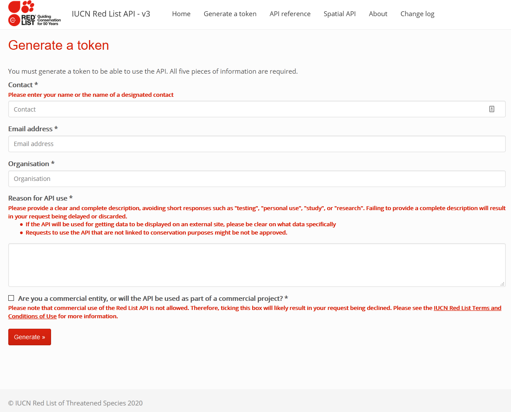

```{r setup, include=FALSE}
knitr::opts_chunk$set(echo = TRUE)
```

## Obtaining IUCN redlist token

First one needs to install the `rredlist` package.
```{r install, eval=FALSE}
install.packages("rredlist")
```

Afterwards, the setup can be initialized thusly:

```{r api setup}
rredlist::rl_use_iucn()
```


This function will open a browser page to request the API token. This is then received by email and in my experience takes around a one day. All fields must be filled in correctly (note that the last box should be left unchecked as we're not doing any for profit projects).

Afterwards, as the prompt in the console states, the token must be copied to the `.Renviron`. The easiest way to do it is to just follow the instructions with the `usethis` package.

## Obtaining depth data

If one has the species name to query, it is easy to obtain IUCN data.

```{r obtain depth data}

search_output <- rredlist::rl_search("Chaetodon ornatissimus")
knitr::kable(search_output$result)
```
It is then very easy to just extract these values to a simple vector. A script or function that looks up this data for all the species numbers is then trivial to obtain.

```{r narrow down depth range}
depth_range <- c(
  "depth_upper" = as.numeric(search_output$result["depth_upper"]),
  "depth_lower" = as.numeric(search_output$result["depth_lower"])
)

depth_range
```
