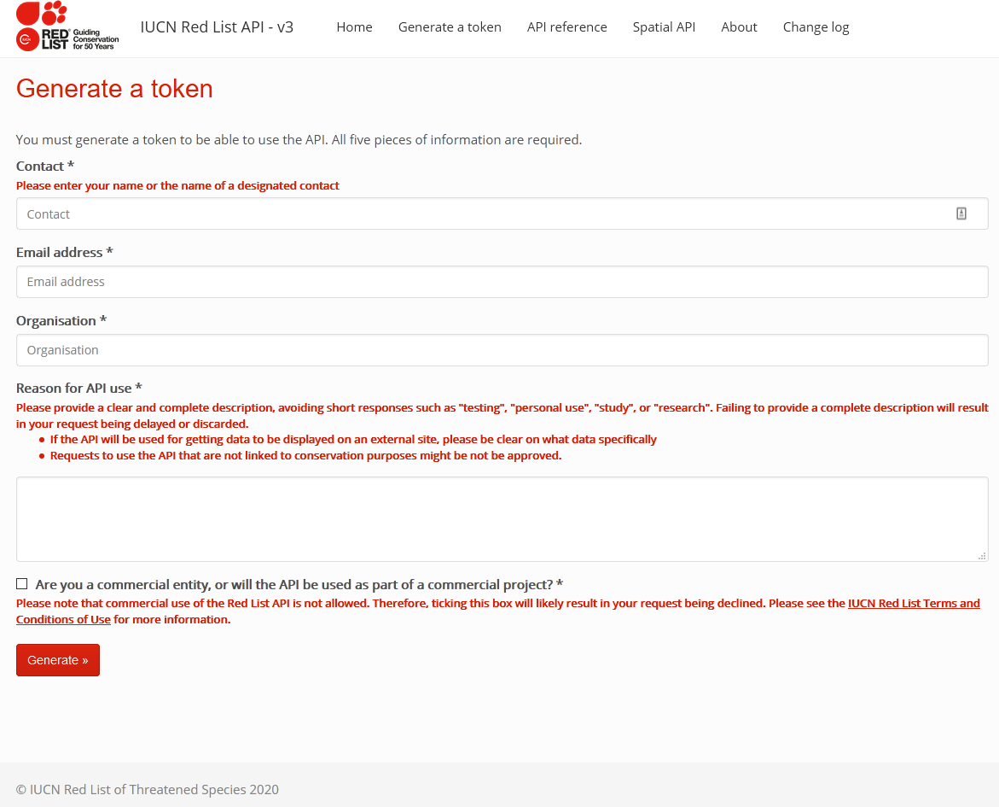

Using rredlist
================

## Obtaining IUCN redlist token

First one needs to install the `rredlist` package.

``` r
install.packages("rredlist")
```

Afterwards, the setup can be initialized thusly:

``` r
rredlist::rl_use_iucn()
```

    ## After getting your key set it as IUCN_REDLIST_KEY in .Renviron.
    ##  IUCN_REDLIST_KEY='youractualkeynotthisstring'
    ##  For that, use usethis::edit_r_environ()



This function will open a browser page to request the API token. This is
then received by email and in my experience takes around a one day. All
fields must be filled in correctly (note that the last box should be
left unchecked as we’re not doing any for profit projects).

Afterwards, as the prompt in the console states, the token must be
copied to the `.Renviron`. The easiest way to do it is to just follow
the instructions with the `usethis` package.

## Obtaining depth data

If one has the species name to query, it is easy to obtain IUCN data.

``` r
search_output <- rredlist::rl_search("Chaetodon ornatissimus")
knitr::kable(search_output$result)
```

| taxonid | scientific\_name       | kingdom  | phylum   | class          | order       | family         | genus     | main\_common\_name   | authority    | published\_year | assessment\_date | category | criteria | population\_trend | marine\_system | freshwater\_system | terrestrial\_system | assessor                    | reviewer                                                   | aoo\_km2 | eoo\_km2 | elevation\_upper | elevation\_lower | depth\_upper | depth\_lower | errata\_flag | errata\_reason | amended\_flag | amended\_reason |
| ------: | :--------------------- | :------- | :------- | :------------- | :---------- | :------------- | :-------- | :------------------- | :----------- | --------------: | :--------------- | :------- | :------- | :---------------- | :------------- | :----------------- | :------------------ | :-------------------------- | :--------------------------------------------------------- | :------- | :------- | :--------------- | :--------------- | -----------: | -----------: | :----------- | :------------- | :------------ | :-------------- |
|  165641 | Chaetodon ornatissimus | ANIMALIA | CHORDATA | ACTINOPTERYGII | PERCIFORMES | CHAETODONTIDAE | Chaetodon | Ornate Butterflyfish | Cuvier, 1831 |            2010 | 2009-10-08       | LC       | NA       | Unknown           | TRUE           | FALSE              | FALSE               | Myers, R.F. & Pratchett, M. | Elfes, C., Polidoro, B., Livingstone, S. & Carpenter, K.E. | NA       | NA       | NA               | NA               |            1 |           36 | NA           | NA             | NA            | NA              |

It is then very easy to just extract these values to a simple vector. A
script or function that looks up this data for all the species numbers
is then trivial to obtain.

``` r
depth_range <- c(
  "depth_upper" = as.numeric(search_output$result["depth_upper"]),
  "depth_lower" = as.numeric(search_output$result["depth_lower"])
)

depth_range
```

    ## depth_upper depth_lower 
    ##           1          36
